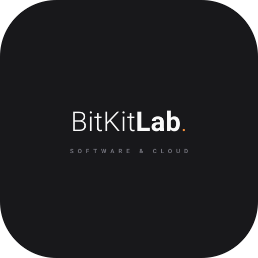

<div align="center">



# BitKit Lab — Core Platform & Web

**Full-Stack Decoupled Architecture • Cloud-Ready Infrastructure**

[](#)
[](#)
[](#)

<p align="center">
  Primer paso del journey: Plataforma web oficial y base arquitectónica de BitKit Lab, diseñada con frontend desacoplado, backend modular bajo principios Clean Code y persistencia relacional lista para la nube.
</p>

</div>

---

## 📌 Visión & Propósito

Este repositorio alberga la presencia digital y el núcleo de servicios de **BitKit Lab**. Sirve no solo como portal de captación y contacto para clientes B2B, sino como nuestra **primera base técnica comprobable**: un sistema full-stack desacoplado construido con los mismos estándares de ingeniería, mantenibilidad y seguridad que implementamos para infraestructuras corporativas.

---

## ⚡ Stack Tecnológico

| Capa | Tecnología | Enfoque & Responsabilidad |
|---|---|---|
| **Frontend** | React / Next.js | Renderizado ágil, interfaz reactiva, componentes modulares y consumo de API |
| **Backend** | Node.js + Express | API REST stateless estructurada bajo patrón MVC estricto |
| **Persistencia** | PostgreSQL | Almacenamiento relacional estructurado, integridad de datos y migraciones |
| **Patrón Arquitectónico** | Decoupled MVC | Separación total de responsabilidades entre cliente, controladores y modelos |
| **Principios Core** | SOLID & Clean Code | Énfasis en Single Responsibility Principle (SRP) y código autodocumentado |
| **Infraestructura** | Cloud-Ready (AWS) | Contenedorización, variables de entorno y desacoplamiento para despliegue en la nube |

---

## 🧱 The BitKit Standard (Arquitectura & Calidad)

> *Firma técnica de BitKit Lab: Construimos software diseñado para resistir cambios de escala, facilitar el mantenimiento y operar sin fallos.*

* **Single Responsibility Principle (SRP):** Cada módulo, controlador y componente tiene una única razón de cambio. Las rutas solo despachan, los controladores orquestan la lógica de negocio y los modelos gestionan exclusivamente la persistencia.
* **Clean Code & Código Mantenible:** Nomenclatura descriptiva, funciones atómicas de bajo acoplamiento y eliminación de efectos secundarios innecesarios.
* **Separación Estricta de Secretos:** Configuración mediante variables de entorno aisladas (`.env`). Cero credenciales o datos sensibles quemados en el código.
* **Persistencia Relacional Confiable:** Esquemas de base de datos diseñados con integridad referencial, transacciones atómicas y facilidad de respaldo automático hacia almacenamiento en la nube (S3).

---

## 📂 Estructura del Proyecto

El sistema divide estrictamente el frontend y el backend para garantizar escalabilidad independiente:

```text
bitkitlab-platform/
├── bitkit_Lab.svg             # Isotipo y vector oficial
├── client/                    # Frontend (React / Next.js)
│   ├── src/
│   │   ├── components/        # Componentes UI reutilizables
│   │   ├── pages/ (o app/)    # Vistas y enrutamiento
│   │   └── services/          # Clientes HTTP para consumo de la API
│   └── package.json
├── server/                    # Backend (Node.js + Express MVC)
│   ├── src/
│   │   ├── config/            # Configuración de base de datos y entorno
│   │   ├── controllers/       # Orquestación de peticiones y respuestas
│   │   ├── models/            # Esquemas y operaciones de datos (PostgreSQL)
│   │   ├── routes/            # Definición de endpoints REST
│   │   └── app.js             # Entrada y middlewares del servidor
│   └── package.json
├── .env.example               # Plantilla de variables de entorno
└── README.md